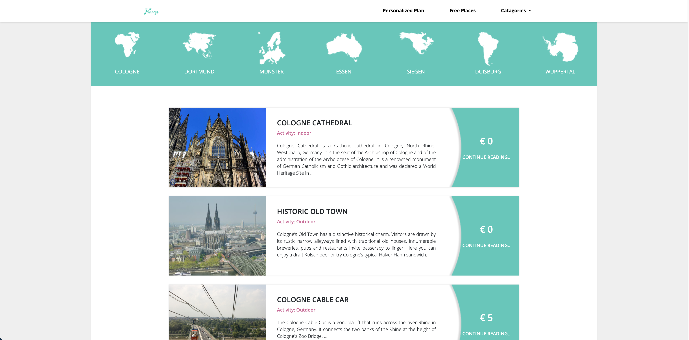
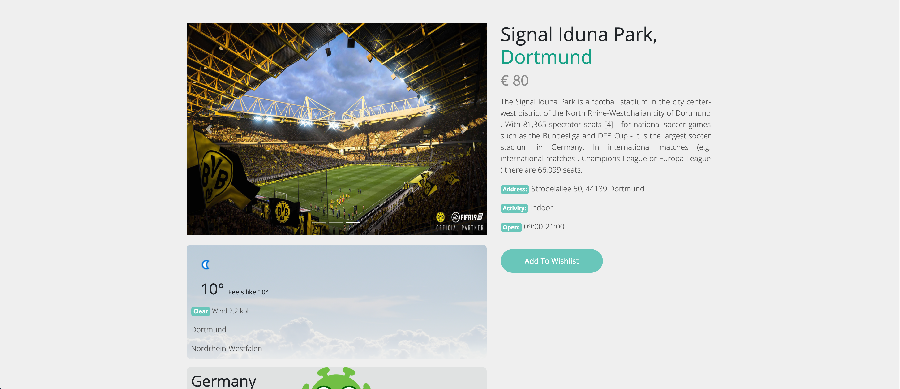

# Journey a travel information app

In this we basically worked with NRW travel data. Traveller can easily search places by city. There are also places by different categories.

The app is build with these following technologies:
* [NodeJS](https://nodejs.org)
* [ExpressJS](https://expressjs.com/)
* [MongoDB](https://www.mongodb.com/)
* [Mongoose](https://mongoosejs.com/)
* [Body-Parser](https://www.npmjs.com/package/body-parser)
* [EJs](https://ejs.co/)

## Home Page

## Top Places in NRW

## Top Places by City

## Place Details Page
